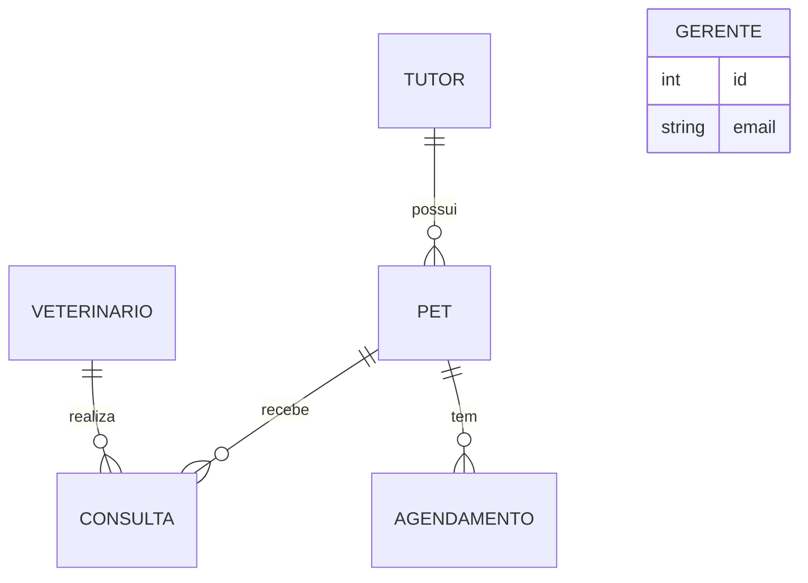

# API Petora

[](https://github.com/JorgeBublitz/ApiPetora/actions/workflows/ci.yml)


API REST para a gestão de um petshop com clínica veterinária: tutores, pets, veterinários, consultas e agendamentos de serviços como banho e tosa.

O acesso é controlado por perfil. **Gerentes** administram tudo. **Veterinários** consultam e registram atendimentos, mas não excluem registros nem gerenciam a equipe.

## Destaques técnicos

- **Autenticação JWT e controle de acesso por perfil (RBAC)**: as permissões vêm do token, nunca do corpo da requisição.
- **Factory de controllers CRUD** com TypeScript genérico: cada recurso declara só o seu service e herda o fluxo padrão.
- **Validação com Zod** em body e parâmetros de rota.
- **Tratamento global de erros**: registro inexistente retorna `404`, e-mail duplicado `409`, ID relacionado inválido `400`, exclusão de registro com vínculos `409`.
- **Exclusões em cascata dentro de transações**: remover um tutor apaga os pets, consultas e agendamentos dele de uma vez só, sem deixar dados pela metade.
- **Segurança**: senhas com bcrypt (nunca retornadas pela API), Helmet, CORS, rate limiting e login com mensagem única para não revelar e-mails cadastrados.
- **32 endpoints** documentados no Swagger, com botão *Authorize* para testar com token.
- **Testes de integração** (Vitest + Supertest) contra PostgreSQL real, rodando no **GitHub Actions**.

## Stack

| Camada | Tecnologias |
| --- | --- |
| Runtime e linguagem | Node.js, TypeScript |
| Framework | Express 5 |
| Banco de dados | PostgreSQL com Prisma ORM |
| Validação | Zod |
| Segurança | JWT, bcrypt, Helmet, express-rate-limit, CORS |
| Documentação | Swagger (OpenAPI 3) |
| Qualidade | Vitest, Supertest, ESLint, GitHub Actions |

## Modelo de dados



## Endpoints

Todas as rotas ficam sob `/api` e exigem `Authorization: Bearer <token>`, exceto o login.

| Recurso | Rotas | Leitura | Criação e edição | Exclusão |
| --- | --- | --- | --- | --- |
| Auth | `POST /auth/login` · `GET /auth/me` | pública / autenticado | | |
| Gerentes | `/gerente` | GERENTE | GERENTE | GERENTE |
| Veterinários | `/veterinario` | autenticado | GERENTE | GERENTE |
| Tutores | `/tutor` | autenticado | autenticado | GERENTE |
| Pets | `/pet` | autenticado | autenticado | GERENTE |
| Consultas | `/consulta` | autenticado | autenticado | GERENTE |
| Agendamentos | `/agendamento` | autenticado | autenticado | GERENTE |

Cada recurso tem `GET /`, `GET /:id`, `POST /`, `PUT /:id` e `DELETE /:id`. A documentação interativa fica em `http://localhost:3000/api-docs`.

```bash
# Login (usuário criado pelo seed)
curl -X POST http://localhost:3000/api/auth/login \
  -H "Content-Type: application/json" \
  -d '{"email": "alice@admin.com", "senha": "senha1234"}'

# Listar pets com o token recebido
curl http://localhost:3000/api/pet -H "Authorization: Bearer <token>"
```

## Como rodar localmente

**Pré-requisitos:** Node.js 20 ou superior e um PostgreSQL acessível.

```bash
git clone https://github.com/JorgeBublitz/ApiPetora.git
cd ApiPetora
npm install
cp .env.example .env         # preencha DATABASE_URL e JWT_SECRET
npx prisma migrate deploy    # cria as tabelas
npm run prisma:seed          # dados de exemplo (gerentes, veterinários, tutores e pets)
npm run dev                  # http://localhost:3000/api
```

Usuários do seed:

| Perfil | E-mail | Senha |
| --- | --- | --- |
| Gerente | `alice@admin.com` | `senha1234` |
| Gerente | `bruno@admin.com` | `senha5678` |

## Scripts

| Comando | O que faz |
| --- | --- |
| `npm run dev` | Servidor com recarga automática |
| `npm test` | Testes de integração (limpa o banco do `DATABASE_URL`; use um banco só para testes) |
| `npm run lint` / `npm run typecheck` | ESLint e checagem de tipos |
| `npm run build` / `npm start` | Build de produção e execução |
| `npm run prisma:seed` | Popula o banco com dados de exemplo |

## Estrutura

```
src/
├── routes/        # Rotas e regras de acesso por perfil
├── controllers/   # Factory CRUD genérica e controllers específicos
├── services/      # Regras de negócio e acesso ao banco
├── schemas/       # Schemas Zod
├── middlewares/   # Autenticação, autorização, validação e erros
├── docs/          # Especificação OpenAPI
├── app.ts         # Configuração do Express
└── server.ts      # Inicialização do servidor
```

## Licença

MIT
